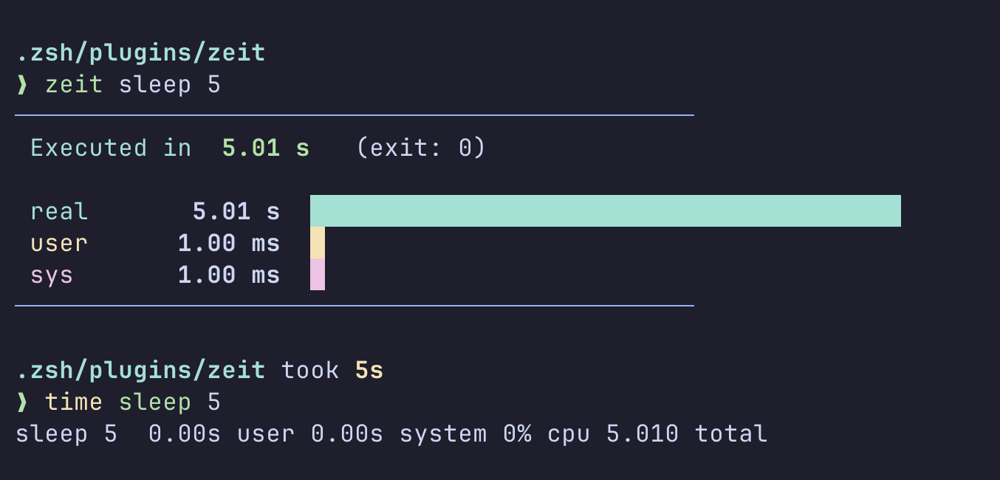

# zsh-zeit

A high-precision, zero-overhead execution timer for Zsh with a beautiful dashboard visualization.




## Why?

Most shell timing plugins either just print a text line like `2.5s` or spawn external processes (like `env time` or `bc`), which adds overhead and creates "parse errors" on different OSs.

**zsh-zeit** is different:
* **Zero Overhead:** Uses zsh's native `time` keyword and math engine. No external processes are spawned.
* **High Precision:** Accurate to microseconds using zsh's internal `TIMEFMT`.
* **Visual Dashboard:** Displays "Real", "User", and "System" time with relative ASCII progress bars.
* **Robust:** Uses File Descriptor swapping (`2>&3`) to ensure your command's output (including errors) is never swallowed or hidden.
* **100% Pure zsh:** No `bc`, no `tr`, no `sed`. Just pure shell code.

## Installation

1. Clone the repository
    ```zsh
      git clone https://github.com/BitRyuu/zeit ~/.zeit

2. Source it in .zshrc
    ```zsh
      source ~/.zeit/zeit.plugin.zsh

